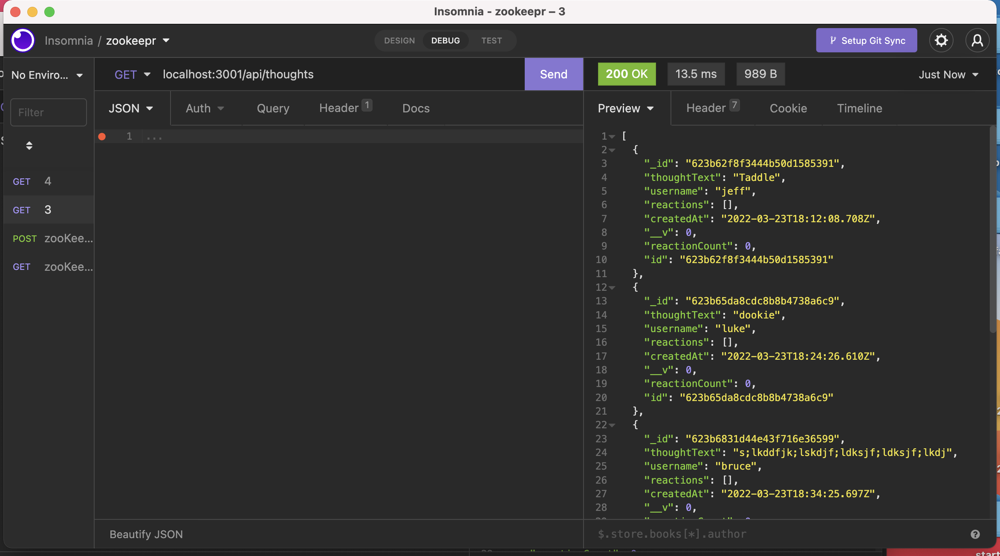
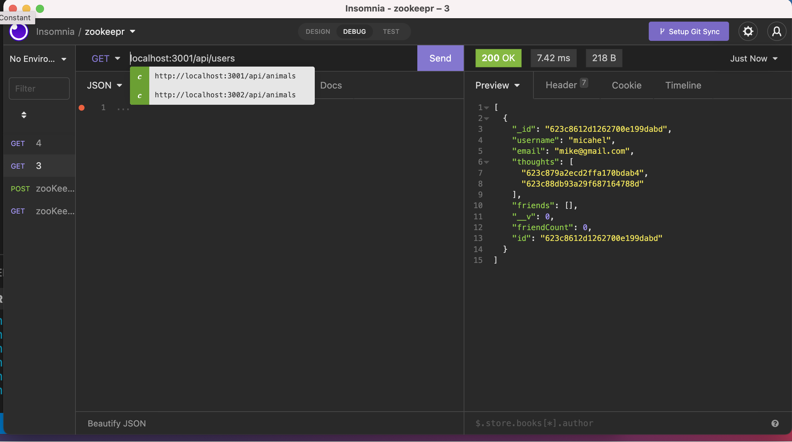

# 18 NoSQL: Social Network API

## User Story

```md
AS A social media startup
I WANT an API for my social network that uses a NoSQL database
SO THAT my website can handle large amounts of unstructured data
```

## Mock-Up

The following pictures shows the get /api/thoughts route:



The following pictures shows the get /api/thoughts route:



## Demo

THe following video displays showcases put, delete, and post routes for both the user and thought models. 

[Video Demo](https://www.youtube.com/watch?v=SFVUS8uO39A)

## Created

By Luke Wofford